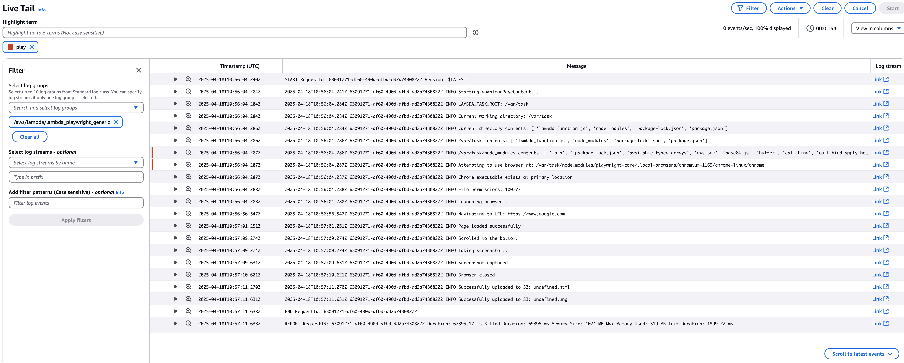
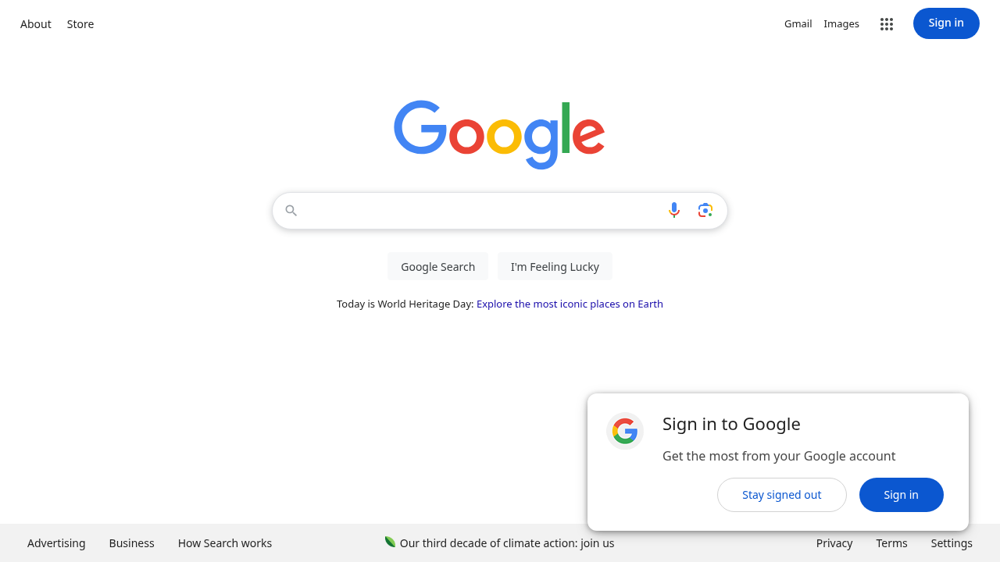

# Serverless Web Scraping with Playwright and AWS Lambda

## 简介
本项目演示了使用 [Playwright](https://playwright.dev/) 和 [AWS Lambda](https://aws.amazon.com/lambda/) 进行无服务器网页抓取的方法。无服务器网页抓取是一个高效的解决方案，让你无需维护服务器，只需为实际使用的计算时间付费。

该项目使用 Node.js 与 Playwright、AWS Lambda 和 Docker。涵盖了从设置 IAM 角色到部署和运行容器化 Lambda 函数的所有内容。

## 前置条件
开始之前，请确保你具备以下条件：

- 具有适当权限的 AWS 账户
- 安装并配置 [AWS CLI](https://aws.amazon.com/cli/)
- 本地机器上安装了 [Docker](https://www.docker.com/)
- Node.js 和 AWS 服务的基础知识

**Windows 用户注意事项：**  
本项目使用 shell 脚本（`.sh` 文件）。Windows 用户可能需要 [WSL2](https://docs.microsoft.com/en-us/windows/wsl/) 或直接在命令提示符中运行 AWS CLI 命令。记得通过以下命令使每个脚本可执行：
```bash
chmod +x script_name.sh
```

## 项目结构

```bash
├── create_iam_role.sh          # 设置 AWS IAM 角色权限
├── deploy.sh                   # 构建 Docker 镜像并部署到 Lambda
├── invoke_lambda.sh           # 调用 Lambda 函数
├── container/
│   ├── Dockerfile             # 配置 Lambda 容器
│   ├── lambda_function.js     # 核心抓取逻辑
│   └── package.json          # Node.js 依赖
```

文件说明：

- **create_iam_role.sh**: 设置具有 S3 和 CloudWatch 权限的必要 IAM 角色。
- **container/lambda_function.js**: 核心抓取逻辑。它初始化 Playwright，导航到目标网页，并将结果存储在 S3 中。
- **container/Dockerfile**: 定义容器环境，确保与 Lambda 和 Playwright 的兼容性。
- **deploy.sh**: 构建 Docker 镜像，推送到 ECR，并部署 Lambda 函数。
- **invoke_lambda.sh**: 用于触发 Lambda 函数的实用脚本，指定目标 URL 和 S3 输出位置。

## 设置和运行步骤

### 步骤 1：设置 IAM 角色

运行 create_iam_role.sh 创建名为 LambdaPlaywrightRole 的角色，具有所需权限：

```bash
./create_iam_role.sh
```

### 步骤 2：Lambda 函数代码

Lambda 函数 (lambda_function.js) 使用 Playwright 导航到给定 URL 并将页面内容上传到 S3。

代码关键部分：
- 异步执行：允许 Playwright 并发处理任务
- 滚动功能：自动滚动到页面底部以加载动态内容
- S3 上传：将页面内容存储在 S3 存储桶中以便检索
- 错误处理：包含详细的错误日志和异常处理
- 浏览器路径处理：自动处理 chromium 可执行文件的路径问题

### 步骤 3：部署 Lambda 函数

使用 Dockerfile 将函数打包在 Docker 容器中以处理复杂依赖关系。运行 deploy.sh 构建 Docker 镜像，推送到 ECR，并部署到 Lambda。

```bash
./deploy.sh
```

注意：根据需要在 deploy.sh 中修改 ECR_ACCOUNT_ID、ECR_REGION 和 LAMBDA_ROLE_ARN。

### 步骤 4：测试 Lambda 函数

使用 invoke_lambda.sh 测试 Lambda 函数。自定义参数以指定目标 URL、S3 存储桶和输出文件名。

```bash
# 基本用法（使用默认 URL）
./invoke_lambda.sh

# 指定自定义 URL 进行抓取
./invoke_lambda.sh "https://example.com"
```

脚本将 Lambda 响应保存到 response.json，允许你检查执行详情。

## Dockerfile 详情

Dockerfile 使用 AWS Lambda Node.js 20 基础镜像，并安装了所有运行 Playwright 所需的系统依赖。

关键配置：
```dockerfile
FROM public.ecr.aws/lambda/nodejs:20

# 安装系统依赖
RUN dnf install -y \
    xorg-x11-server-Xvfb \
    libX11 \
    # ... 其他依赖
```

## 运行效果展示

### Lambda 执行日志


### 抓取结果示例


## 依赖说明

主要 Node.js 依赖：
```json
{
  "dependencies": {
    "playwright": "^1.40.0",
    "aws-sdk": "^2.1499.0"
  }
}
```

## 重要说明

### Chromium 路径处理
Lambda 环境中的 Chromium 路径需要特别注意：
1. Chromium 必须位于 `/var/task` 目录下
2. 代码会自动处理路径问题：
   - 主要路径：`/var/task/node_modules/playwright-core/.local-browsers/chromium-1169/chrome-linux/chrome`
   - 如果主路径不存在，会自动从 `/root/.cache/ms-playwright` 复制

### 本地测试技巧

要在本地测试容器：
```bash
docker run -it --entrypoint /bin/bash 390468416359.dkr.ecr.us-east-1.amazonaws.com/container-playwright:latest
```

示例测试事件：
```json
{
    "url": "https://www.youtube.com",
    "bucket": "aigc.red.plaza",
    "outputKey": "pw/youtube"
}
```

## 结论

使用 Playwright 与 AWS Lambda 实现了高效的无服务器网页抓取。通过将函数打包在 Docker 容器中，我们确保了所有依赖与 Lambda 兼容。该项目为周期性抓取任务提供了一个可扩展的解决方案，特别适用于传统服务器成本过高或效率低下的场景。
